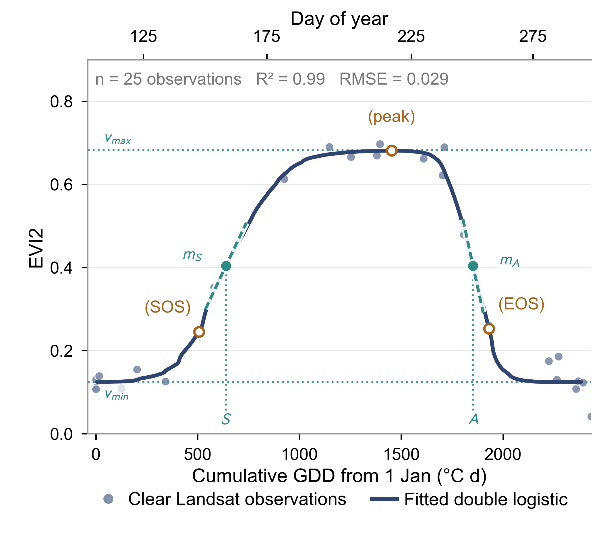
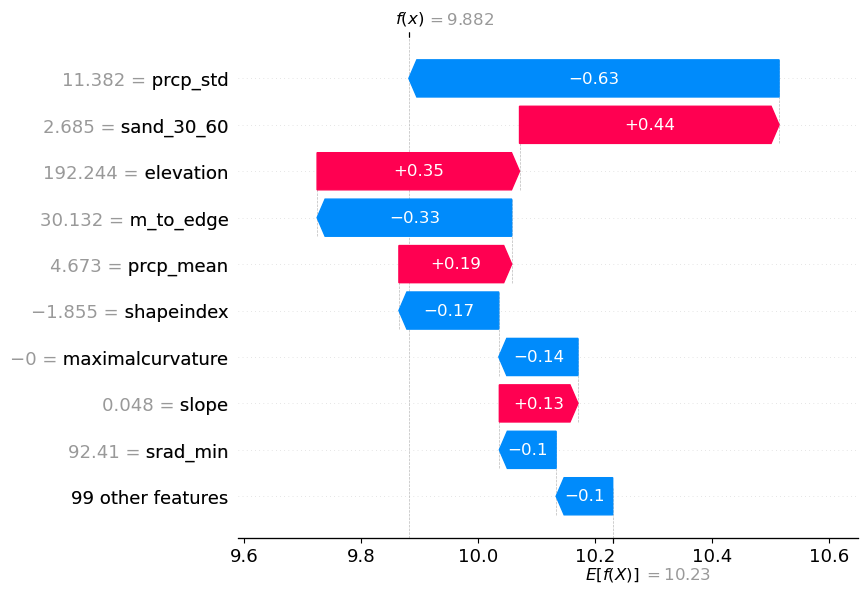
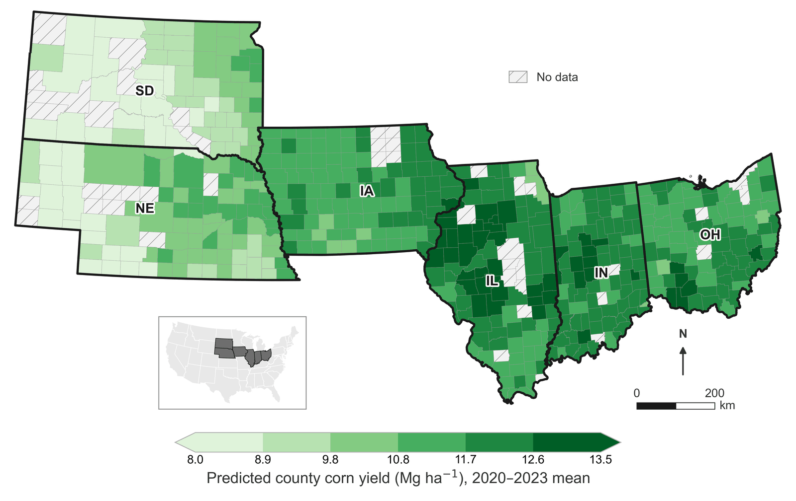

::: {.lede}
My research asks how agricultural systems can operate within ecological limits,
and how we test, monitor, and develop systems that promote biodiversity rather
than erode it. These questions are both theoretical and empirical, but the
applied answers are urgently needed. The three lines of work below approach that
question from different directions: what we can measure, where the limits fall,
and what land can sustain.
:::

## Seeing what sampling can't

::: {.thrust}
{.lightbox fig-alt="Landsat EVI2 observations across a growing season with a fitted double-logistic curve, marking start of season, peak, and end of season against cumulative growing degree days."}

::: {}
[UAV hyperspectral · Satellite time series · Ground penetrating radar · Apparent electrical conductivity]{.thrust-meta}

Many of the properties that govern how a system functions are invisible to conventional sampling, or too costly to measure at the scale decisions get made. However, modern sensors help close that gap. Working across satellite, UAV, and proximal platforms, I develop methods to quantify crop and nutrient dynamics at landscape and watershed scale. In soybean, I found that irrigation regime is detectible in the canopy spectrum itself, separable from reflectance alone at over 95% accuracy.

[Selected work: [subsurface soil characterization with ground penetrating radar in a silvopastoral system](https://doi.org/10.32389/JEEG22-001) · [delineating field variation in an agroforestry system](https://doi.org/10.3390/rs14225777)]{.thrust-work}

:::
:::

## Finding the thresholds that matter

::: {.thrust}
{.lightbox fig-alt="SHAP waterfall plot showing how individual features including precipitation variability, sand content, and elevation push a single yield prediction above or below the model's expected value."}

::: {}
[SHAP · Explainable AI · Boundary line analysis · Limiting factors · Spatial cross-validation]{.thrust-meta}

Ecological systems rarely respond to their drivers in easily understood ways. Production is governed by whatever factor is most limiting, and responses often shift abruptly once a threshold is crossed. I use interpretability methods, including SHAP and boundary line analysis, to recover those limiting factors and critical values from models that would otherwise stay opaque. In U.S. maize, for example, yield falls sharply once maximum temperatures exceed roughly 36 to 38°C.

[Selected work: [environmental drivers of U.S. maize and soybean yield](https://doi.org/10.1038/s41598-026-38724-z) · [critical soil values for major crops in Guatemala](https://doi.org/10.1002/agj2.21412)]{.thrust-work}
:::
:::

## What land can sustain

::: {.thrust}
{.lightbox fig-alt="County-level map of predicted corn yield across South Dakota, Nebraska, Iowa, Illinois, Indiana, and Ohio, averaged over 2020 to 2023."}

::: {}
[Species distribution models · MaxEnt · Ecosystem recovery · Soil and climate suitability]{.thrust-meta}

What land can support is not fixed. It is set by soil, climate, and terrain, and it can be degraded past a limit or brought back across one. I use species distribution models and geospatial techniques to map where a given use is viable, and time series analysis to track whether degraded land is regaining capacity. Across 123 reclaimed mining waste sites at the Tar Creek Superfund Site, revegetation took an average of 3.5 years, a trajectory that would be prohibitively expensive to establish with field crews alone.

[Selected work: [vegetative recovery and land cover change after reclamation at the Tar Creek Superfund Site](https://doi.org/10.1007/s44288-024-00057-7) · [crop and soil suitability on U.S. Tribal Lands](https://doi.org/10.3390/agriculture12091307)]{.thrust-work}
:::
:::

## Software and tools

Code from published work is on [GitHub](https://github.com/harrisonwsmith).
